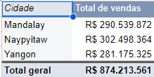
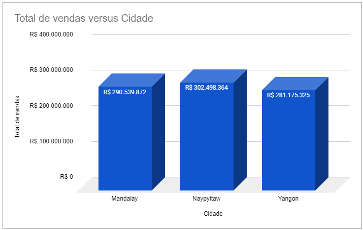
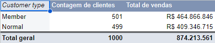
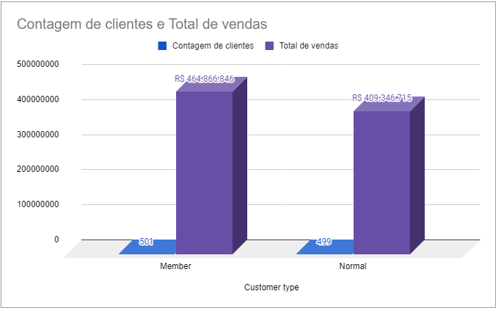
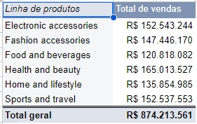
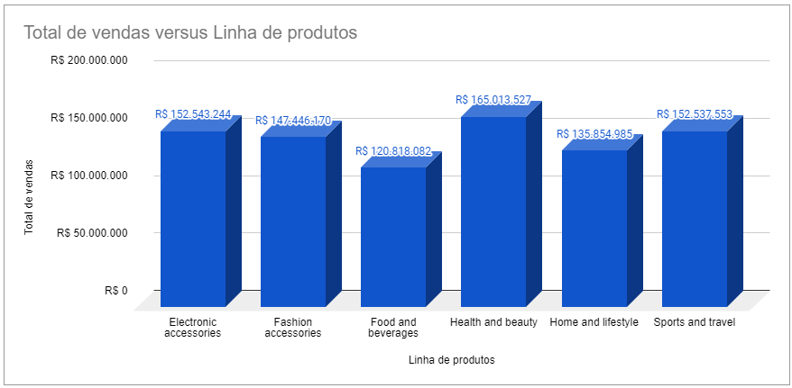
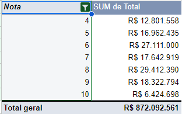
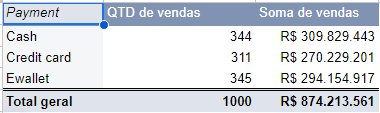
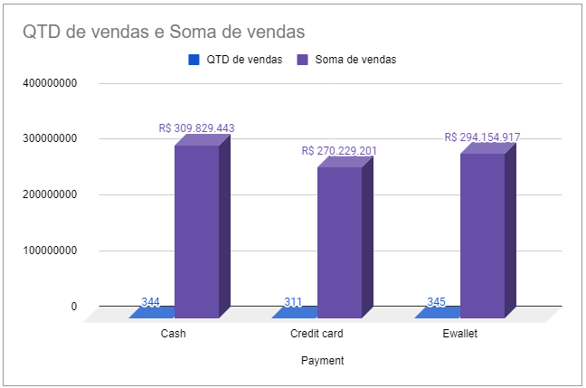

# Projeto Analise Vendas de supermecado com Excel

## Introdução

Esse projeto tem como intuito obter insights de vendas de um supermecado utilizando tabela dinamica e graficos extraidos de uma csv no excel.
O supermecado baratão Tem uma tabela para a gestão de dados de vendas que contém as seguintes colunas:
* Invoice ID (ID da fatura): Número de identificação da fatura do recibo de venda gerado por computador.
* Agência: filiais do supermercado (3 agências estão disponíveis identificadas por A, B e C).
* Cidade: Localização dos supercentros.
* Tipo de cliente: Tipo de clientes, registrados por Membros para clientes que usam cartão de membro e Normal para sem cartão de membro.
* Gênero: Tipo de gênero do cliente.
* Linha de produtos: Grupos de categorização de itens gerais - Acessórios eletrônicos, Acessórios de moda, Alimentos e bebidas, Saúde e beleza, Casa e estilo de vida, Esportes e viagens.
* Preço unitário: Preço de cada produto em $
* Quantidade: Número de produtos comprados pelo cliente
* Imposto: Taxa de imposto de 5% para compra do cliente
* Total: Preço total incluindo imposto
* Data: Data da compra (Registro disponível de janeiro de 2019 a março de 2019)
* Hora: Hora da compra (10h às 21h)
* Pagamento: Pagamento usado pelo cliente para compra (3 métodos estão disponíveis - Dinheiro, Cartão de crédito e Ewallet)
* COGS: Custo dos produtos vendidos
* Porcentagem de margem bruta: Porcentagem de margem bruta
* (Renda bruta): Valor obtido na venda.
* Classificação: Classificação de estratificação do cliente em sua experiência geral de compra (em uma escala de 1 a 10)
Nesse case foram feitas 5 perguntas sobre essa tabela com o objetivo de obter insights de analise de dados. 

## Case 

1. **Qual é o desempenho de vendas por cidade?**
   - Insight: Entender quais agências e cidades têm maior volume de vendas e quais precisam de estratégias para aumentar o desempenho.

2. **Como o tipo de cliente (Membro vs. Normal) influencia o total das vendas e a frequência de compras?**
   - Insight: Determinar se os membros gastam mais ou compram com mais frequência do que os clientes normais, o que pode ajudar a ajustar estratégias de fidelização.

3. **Quais são as linhas de produtos mais populares e qual é a sua contribuição para a receita total?**
   - Insight: Identificar quais categorias de produtos geram mais receita e quais podem precisar de mais promoção ou ajuste no mix de produtos.

4. **Qual é a relação entre a classificação da experiência de compra e a quantidade gasta ou a linha de produtos comprada?**
   - Insight: Analisar se clientes que dão uma classificação alta gastam mais ou preferem certos tipos de produtos, o que pode ajudar a melhorar a experiência do cliente e aumentar as vendas.

5. **Como diferentes métodos de pagamento (Dinheiro, Cartão de crédito, Ewallet) afetam o comportamento de compra dos clientes?**
   - Insight: Verificar se há uma preferência por métodos de pagamento e como isso influencia o valor das compras, o que pode ajudar na otimização das opções de pagamento oferecidas.

## Resolução do case
## 1. **Qual é o desempenho de vendas por cidade?**

 ### 💡  Resposta: Naypyitaw tem a maior receita. Mandalay está a 2º e Yangon em 3º.

## 2. **Como o tipo de cliente (Membro vs. Normal) influencia o total das vendas e a frequência de compras?**
   

### 💡 Resposta: Clientes membros gastam mais e compram mais com uma taxa de variação = 0,2%.

## 3. **Quais são as linhas de produtos mais populares e qual é a sua contribuição para a receita total?**
   

### 💡 Resposta: A linha de produtos de saude e beleza é a mais popular, representando 18,87% do total de vendas.

## 4. **Qual é a relação entre a classificação da experiência de compra e a quantidade gasta?**
   

 ### 💡 Resposta: Clientes tendem a comprar mais produtos nota 6, porém gastaram mais com produtos nota 8.

## 5. **Como diferentes métodos de pagamento (Dinheiro, Cartão de crédito, Ewallet) afetam o comportamento de compra dos clientes?**
   

 ### 💡 Resposta: Clientes tendem a fazer mais compras com carteiras virtuais (Ewallet).
